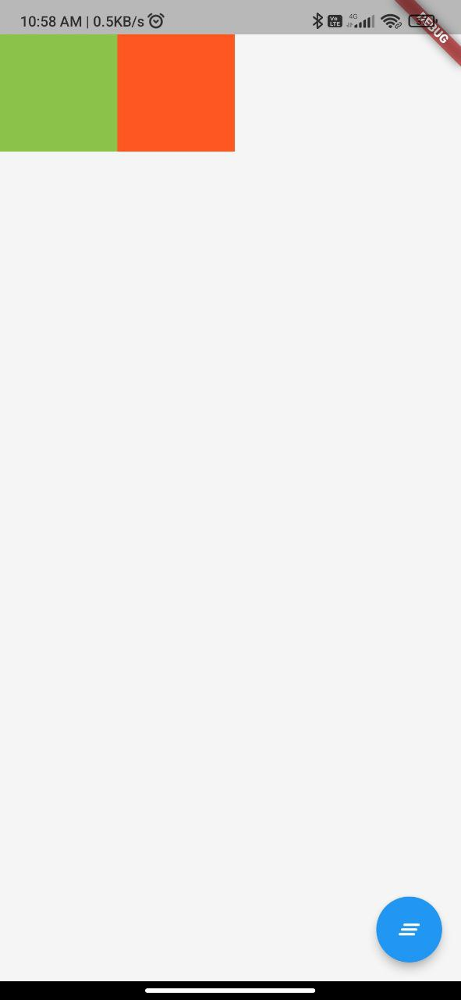
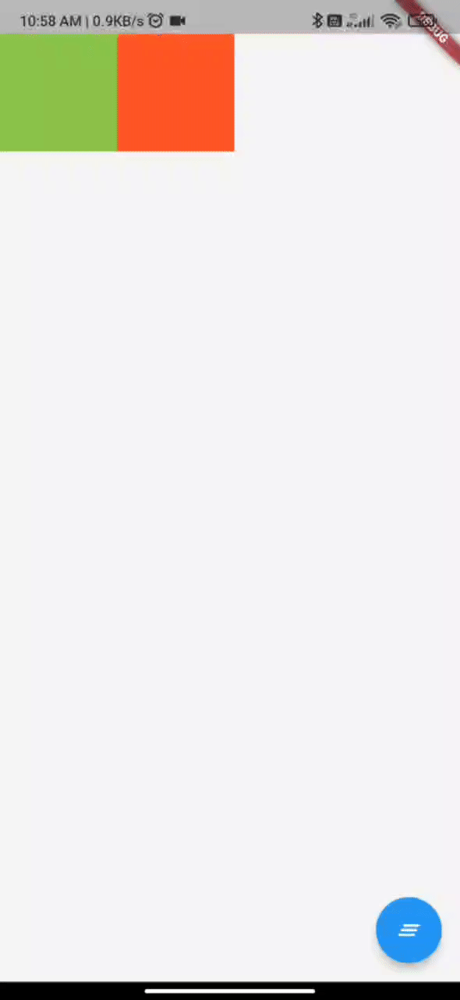

<h1>FLUTTER DEVELOPMENT INTERNSHIP ASSIGNMENT</h1>
<h2>Description</h2>

I had created a Window which contains two block which generate random colors every they being called, And when tapping on a floating button situated at right bottom of window , they swapped and when tapped again Containers reapear.

<h2>Working of the Source Code</h2>

1. In the main.dart file,the main function contains a runApp() method which takes MyApp class as parameter and furthur created a class named MyApp which extends StatelessWidget which returns a MaterialApp widget and in the 'home' parameter it takes MyHomePage class. 
2. This MyHomePage class extends StatefullWidget which is located in 'lib' folder. In the MyHomePage class, it contains a Scaffold widget which contains a floatingActionButton widget and a body widget.  
3. The floatingActionButton widget is a FloatingActionButton widget and it contains a onPressed() method which calls the swapped() method and Take a Icon as child. 
4. The swapped() function is a method which contains an 'ifelse' condition and if condition is true then the swap variable change to false and vice versa. 
5. In the MyHomePage class a List of Container widgets is created and the list is filled with MyContainer class. 
6. This MyContainer class extends StatefullWidget which is located in 'lib/components' folder. In the MyContainer class, 'build' method returns a Container widget which has height of 100 and width of 100 and a color property which is set to a 'clr' variable, this 'clr' variable is defind as 'Color' data type. 
7. In the 'initstate()' method, the 'clr' variable is set to a random color.

<h2>ScreenShots</h2>

